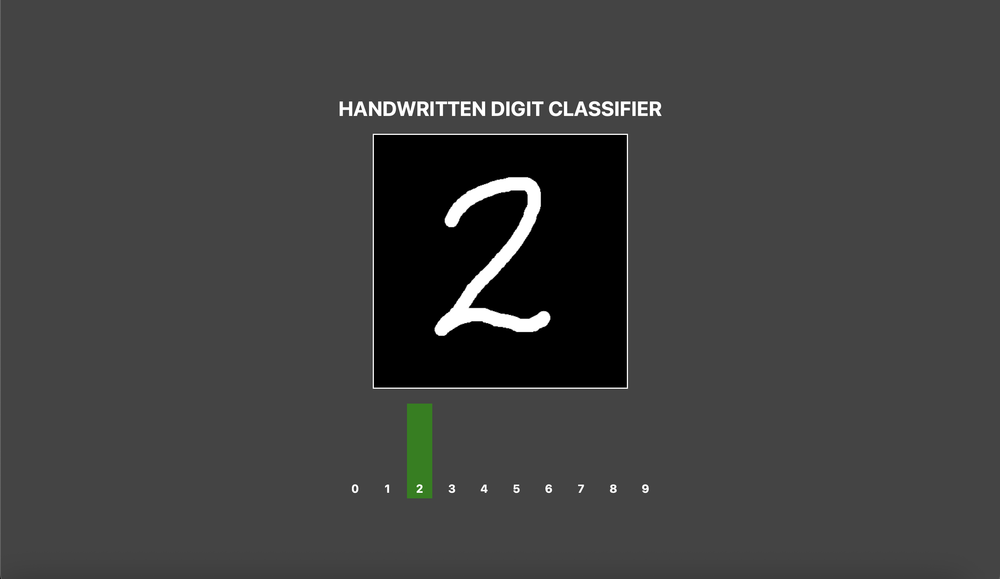

# Digit Recognition App

A simple web application that recognizes handwritten digits using a custom-built Multi-Layer Perceptron (MLP).
The backend is powered by FastAPI, while the frontend is plain HTML + CSS + JavaScript.

------------------------------------------------------------
Features
------------------------------------------------------------
- Draw a digit (0–9) directly on a canvas.
- Real-time prediction of the digit using a trained MLP model.
- Visualization of prediction probabilities as a bar chart.
- Fully custom MLP implementation written only with NumPy and Python built-ins.

------------------------------------------------------------
Model
------------------------------------------------------------
The MLP was implemented from scratch (no frameworks).
- All training-related code and documentation can be found [here](https://github.com/lwilanski/diy-neural-network).
- For this project, the training logic was removed, and the trained parameters are loaded from the model-parameters/ directory.

------------------------------------------------------------
Getting Started
------------------------------------------------------------

1. Clone the repository
   - SSH:
     `git clone git@github.com:lwilanski/digit-recognition-app.git`

   - HTTPS:
     `git clone https://github.com/lwilanski/digit-recognition-app.git`

   `cd digit-recognition-app`

2. Set up a virtual environment
   Python 3.13 is recommended, though most Python 3 versions should work.

   `python -m venv venv`

   Activate the environment:

   - Linux / macOS:
     `source venv/bin/activate`

   - Windows:
     `.\venv\Scripts\activate`

3. Install dependencies
   `pip install -r requirements.txt`

4. Run the backend
   `uvicorn server:app --port 8000`

5. Run the frontend
   Simply open index.html in your preferred browser.
   (Optionally, you can serve it via a local web server such as VS Code Live Server or: python -m http.server)

------------------------------------------------------------
Using the app
------------------------------------------------------------
Draw with your mouse on the canvas, the predicition will dynamically update.
Use backspace to clean the canvas.

------------------------------------------------------------
Project Structure
------------------------------------------------------------
digit-recognition-app/
├── model-parameters/     # Trained MLP weights & biases
├── src/                  # MLP and utility functions
├── server.py             # FastAPI backend
├── index.html            # Frontend entry point
├── style.css             # Frontend styling
├── app.js                # Frontend logic
├── requirements.txt      # Python dependencies
└── README.md             # Project documentation

------------------------------------------------------------
Demo
------------------------------------------------------------

------------------------------------------------------------
License
------------------------------------------------------------
MIT License – feel free to use and modify.
